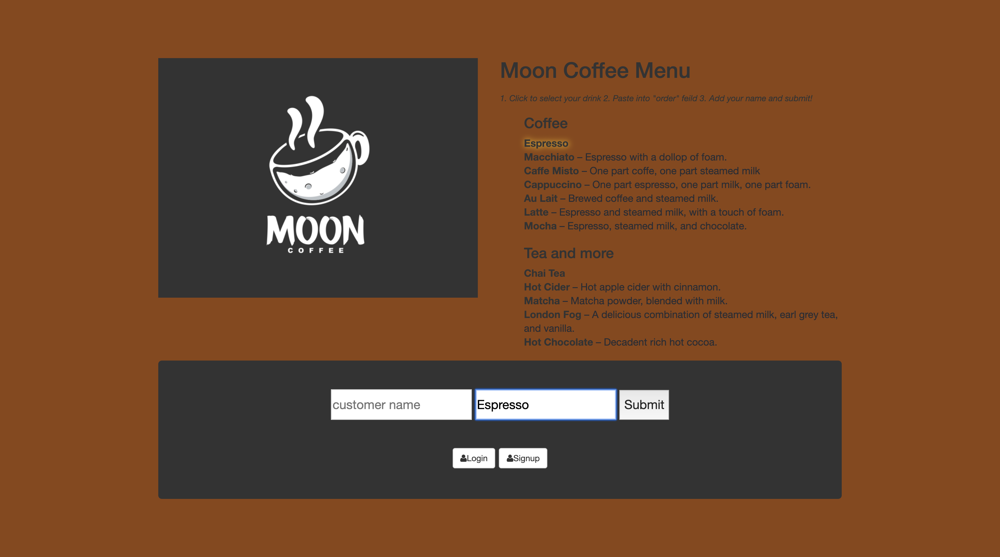

## To run on your server:

1. Clone repo
2. run `npm install`
3. run `node server.js`
4. Navigate to `localhost:8080`
5. To select a drink click and paste! (honestly the best part of my app)

## Credit

Credit for cool copy code from https://stackoverflow.com/questions/45071353/copy-text-string-on-click 
(User had no name :/)
